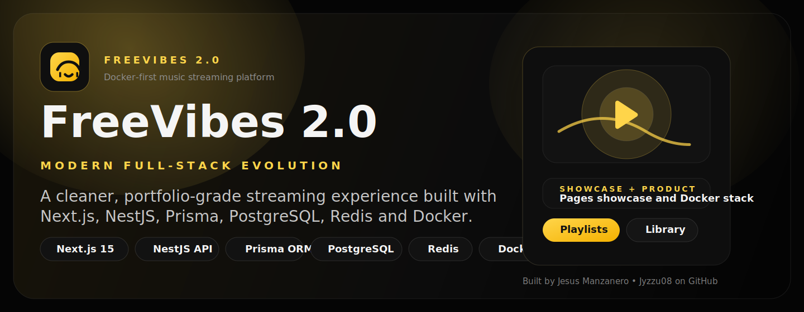

# FreeVibes 2.0




FreeVibes 2.0 is a portfolio-grade full-stack streaming platform that evolves the original FreeVibes concept into a modern, Docker-first product. It combines a Next.js 15 frontend, a NestJS API, Prisma, PostgreSQL, Redis, uploads, real playlists, user library flows, playback history and an admin panel, while preserving the original black / yellow / white visual identity.

Built by [Jesus Manzanero](https://www.jesusmanzanero.info/) | [GitHub profile](https://github.com/Jyzzu08)

## Live Demo

FreeVibes 2.0 ships with two complementary demo layers:

1. **Public showcase via GitHub Pages**
   A static but playable showcase lives in [`docs/`](./docs/) and is deployed automatically by [`pages.yml`](./.github/workflows/pages.yml). It includes a full-length CC0 jazz track, architecture framing, validation notes and clear CTAs for trying the full stack locally.
2. **Full Docker demo**
   The complete product experience runs locally with Docker Compose: auth, playlists, library, uploads, admin and the real API.

Important:

- GitHub Pages cannot host the full NestJS + PostgreSQL + Redis stack.
- The Pages site is an honest public entry point, not a fake full-stack deployment.
- The repository is prepared for a future split deploy where frontend, backend and database move to dedicated services.

## Portfolio Context

FreeVibes 2.0 is designed as a serious portfolio piece, not just a UI clone:

- product thinking over static screens
- full-stack architecture with modular backend boundaries
- Docker-first reproducibility
- persistence, uploads and admin tooling
- public GitHub presentation plus a future-ready deployment strategy

## Stack

- Frontend: Next.js 15, TypeScript, App Router
- UI: Tailwind CSS v4, shared components, dark premium styling and motion-safe transitions
- State: Zustand
- Backend: NestJS, Swagger, DTO validation, guards, throttling and hardened uploads
- ORM: Prisma
- Database: PostgreSQL
- Cache foundation: Redis
- Infra: Docker Compose, Nginx, GitHub Actions, GitHub Pages

## Architecture

```text
/apps
  /api
  /web
/packages
  /config
  /types
  /ui
/infra
  /docker
  /nginx
  /scripts
/docs
/assets
/.github/workflows
/docker-compose.yml
/.env.example
/README.md
```

### Main responsibilities

- `apps/web`: landing, browse, search, artist, album, playlist, library, profile, auth and admin
- `apps/api`: `health`, `auth`, `users`, `catalog`, `search`, `uploads`, `playlists`, `library`, `playback`, `admin`
- `docs/`: public GitHub Pages showcase, publication kit and deployment notes
- `assets/legacy-dataset/`: bundled XML seed source so the repo can seed itself without an external sibling folder

## Features

- JWT auth with refresh token flow
- editable profile
- real playlists with add, remove and reorder
- favorites, saved albums and followed artists
- playback history and recently played
- persistent player state
- admin CRUD for genres, artists, albums and tracks
- local uploads with validation and future S3-ready structure
- public GitHub Pages showcase with a full-length CC0 jazz track

## Public Showcase Audio

The public Pages showcase includes one legally reusable jazz track:

- Track: `Jazz at the park`
- Source page: <https://commons.wikimedia.org/wiki/File:Jazz_at_the_park.ogg>
- License: `CC0 1.0`
- Local note: [`docs/audio-license.md`](./docs/audio-license.md)

This audio is only used by the static showcase. The full Docker application still relies on the project seed and local development assets.

## Validation

Validated with real commands and runtime checks before preparing the repo for publication.

### Services validated

- `postgres`
- `redis`
- `api`
- `web`
- `nginx`

### Functional flows validated

- register
- login
- logout
- profile update
- browse
- search
- artist page
- album page
- playlist page
- favorites
- saved albums
- followed artists
- playback history
- recently played
- admin bootstrap
- audio upload
- large image upload
- Docker runtime and proxy routing

### Commands executed successfully

- `docker compose config`
- `docker compose up --build -d`
- `docker compose ps`
- `docker compose exec web pnpm lint`
- `docker compose exec web pnpm test`
- `docker compose exec web pnpm build`
- `docker compose exec api pnpm --filter @freevibes/api test:e2e`
- `docker compose exec api pnpm --filter @freevibes/api exec prisma validate`
- `docker compose exec api sh -lc "unset LEGACY_ROOT && export SEED_FORCE_RESET=true && cd /workspace && pnpm --filter @freevibes/api prisma db seed"`

### Routes checked

- Direct web: `/`, `/browse`, `/search`, `/artists/[slug]`, `/albums/[slug]`, `/playlists/[slug]`, `/library`, `/profile`, `/admin`, `/login`, `/register`
- Proxy: `/`, `/search`, `/health`, `/docs`, `/audio/demo/...`
- Static showcase: `/`, `/styles.css`, `/app.js`, `/assets/audio/jazz-at-the-park.ogg`

## Demo Credentials

- Admin: `admin@freevibes.local` / `FreevibesAdmin123!`
- Demo user: `listener@freevibes.local` / `FreevibesUser123!`

## Run Locally

### Docker-first

```bash
docker compose up --build
```

Services:

- Web: `http://localhost:3000`
- API: `http://localhost:3001`
- Swagger: `http://localhost:3001/docs`
- Health: `http://localhost:3001/health`
- Unified proxy: `http://localhost:8080`

### Local workspace

```bash
pnpm install
pnpm --filter @freevibes/api exec prisma generate
pnpm --filter @freevibes/api exec prisma migrate deploy
pnpm --filter @freevibes/api exec prisma db seed
pnpm dev
```

## Environment

Template: [`./.env.example`](./.env.example)

Main variables:

- `NEXT_PUBLIC_API_BASE_URL`
- `DATABASE_URL`
- `REDIS_URL`
- `JWT_ACCESS_SECRET`
- `JWT_REFRESH_SECRET`
- `REFRESH_TOKEN_COOKIE_NAME`
- `LOCAL_STORAGE_BASE_URL`
- `ALLOWED_ORIGINS`
- `COOKIE_SECURE`
- `SEED_FORCE_RESET`

Optional:

- `LEGACY_ROOT` if you explicitly want to point the seed to an external legacy dataset

## GitHub-Ready Notes

- Only `freevibes-v2` is intended to be published as the public repository
- Secrets are not stored in the repository; `.env` files remain ignored
- The seed is self-contained thanks to the bundled XML dataset under `assets/legacy-dataset`
- CI is included in [`ci.yml`](./.github/workflows/ci.yml)
- GitHub Pages is included in [`pages.yml`](./.github/workflows/pages.yml)
- Code is licensed under [`MIT`](./LICENSE)

## Public Demo Strategy

The repository is prepared for a professional GitHub publication flow:

- [`docs/`](./docs/) contains the static showcase for GitHub Pages
- [`pages.yml`](./.github/workflows/pages.yml) deploys the showcase automatically from GitHub Actions
- [`deployment-notes.md`](./docs/deployment-notes.md) documents the split between showcase, local Docker demo and future production deploy
- [`publication-kit.md`](./docs/publication-kit.md) contains reusable copy for GitHub and portfolio

This gives the repo:

- a public URL for instant exploration
- a real audio element users can try directly in the browser
- a local Docker path for full-stack proof
- a clean future path toward managed frontend/backend/database hosting

## Portfolio Assets

- Public showcase: [`docs/`](./docs/)
- README hero: [`freevibes-readme-hero.svg`](./docs/assets/freevibes-readme-hero.svg)
- Social preview: [`freevibes-social-preview.png`](./docs/assets/freevibes-social-preview.png)
- Social preview source: [`freevibes-social-preview.svg`](./docs/assets/freevibes-social-preview.svg)
- Publication copy: [`publication-kit.md`](./docs/publication-kit.md)

## Roadmap

- real metadata sync module with MusicBrainz and Cover Art Archive
- S3-compatible storage provider
- richer admin tables with filtering and pagination
- more API and UI e2e coverage
- managed split deployment for frontend, backend, database and object storage
